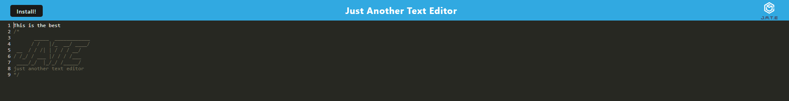

# JATE-JustAnotherTextEditor by Alan Lee

## Credits
The source code for this application, namely the client-server folders along with the code-mirror setup and execution were all done by the EDX-Bootcamp out of the Extended University of Wisconsin Campus! It was great getting to see this in action! Also, WebpackHTML documentation alongside WebpackPWAManifest documentation were absolutely vital for this project.

## Table of Contents

[Description](#description)

[Installation](#installation)

[Usage Information](#usage-information)

[Testing Instructions](#testing-instructions)

[Deployed Website](#deployed-website)

[Questions?](#questions?)

[Contributing](#contributing)

[License](#license)

## Description 
This Progressive Web Application is a text editor that will allow a user to work offline on some basic coding! It uses Code Mirror as a base for the editor and Webpack for the bundling and caching of images. Several other technologies are at play such as HTML-Plugin Manifest.

## Installation
N/A

## Usage Information
Anyone can use this application for any reason!

## Testing Instructions
N/A

## Deployed Website 

Link to Alan Lee's JATE-JustAnotherTextEditor: https://jate-justanothertexteditor.onrender.com

## Questions?
Please Contact Alan Lee at aflee227@gmail.com if you have additional questions.

## Contributing 
There is no way to contribute to this application.

## License 
The MIT was used for the creation and the publication of this Repository and Webpage.
